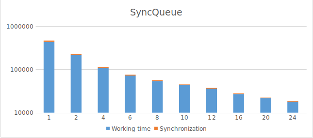
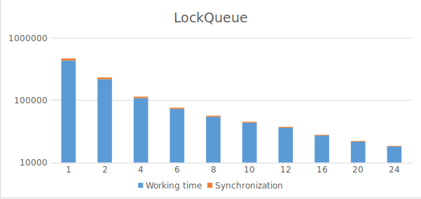
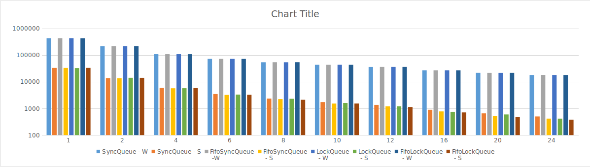

##### CreatingThreads

- [ ] Run the code above. What do you observe? Is this the *expected* behaviour?

    Every thread counts down but we can not distinguish between them.
    Also the "main" can finish faster then the other threads.  
	
ER: OK

- [ ] Fix the problem identified by using the appropriate method from the `Thread` class.

    We need to "join" threads back to the "main" [(code available here)](src/queues/FinalCountdowns.java).

    ```java
        for (int i=0; i<8; i++) {
            t[i].join();
        }
        System.out.println("IGNITION!!!");
    ```

ER: OK

- [ ] Modify the code so that each thread counts down exactly 5 seconds and not as fast as it can.

    ```java
        System.out.print(c + "... ");
        Thread.sleep(1000);
    ```

ER: OK (needs the try/catch block)

- [ ] You will see that some of the methods you used may throw an [`InterruptedException`](https://docs.oracle.com/javase/7/docs/api/java/lang/InterruptedException.html). What is the purpose of this exception?

    Thrown when a thread is waiting, sleeping, or otherwise occupied, and the thread is interrupted, either before or during the activity. Occasionally a method may wish to test whether the current thread has been interrupted, and if so, to immediately throw this exception.

ER: The exception is not thrown when the thread checks if it is interrupted, it allows 'waking up' the thread who is otherwise waiting or sleeping. You do not really explain the purpose, which is to properly terminate threads (deferred cancellation), which would be otherwise impossible for threads waiting.

- [ ] We cannot distinguish between the outputs of each thread, in particular for the line showing `ready`. Modify the program so that each thread gets an identity (thread number) and uses it for its output.

    We can do it this way:
    ```java
        long thID = Thread.currentThread().getId();
    ```

ER: OK

##### Monitors

- [ ] Execute the code several times (hint: you can add more producers than consumers if necessary). Is the behavior as expected?

    No, there is deadlock. Also the threads using busy waiting (while cycle).

ER: This is not a deadlock as defined in class. What you see is that the counters are wrong due to concurrent, non atomic updates.

- [ ] Remove the initial waiting time before threads start consuming and producing elements. What is the behavior and how can we explain it?

    There is also deadlock or something is still left in the queue. It depend on the access to the counter. For example two threads can access it in the same time but the increment will be only by one insted of two.

ER: Yes (but not a deadlock), but why?

- [ ] Use a large number of produced and consumed elements and remove all waiting times. What happens?

    Again deadlock with busy waiting.

ER: Not a deadlock, see previous.

- [ ] What is the consistency model offered by the SharedCounterMonitor class? Let us now imagine that we remove the `synchronized` keyword from the `get()` method. Does this change the consistency model and how? (you may need to wait for the third lecture to answer this question)

    It should be Linearizability.
    If we removed `synchronized` from `get()` method then threads can read the counter in parallel and the execution of program should be faster because we do not waste time on synchronization for this operation. The function of program will not change. 
    And now it should be Sequential Consistency because non-overlapping operations can be re-order in different threads.

ER: OK

- [ ] What happens if we use a `notifyAll()` call instead of `notify()` in this example? Is our code still matching the specification? If not, what would be required?

    All the sleeping threads will wake up and make the decrement. So we can go to negative numbers in the counter.
    We can repair it with `while`:
    
    ```java
        if (counter == 0){} -> change it to:  while (counter == 0){}
    ```  

ER: OK

- [ ] Fix the implementation of the shared queue to form a linearizable, safe concurrent object of class `SyncQueue`. Your implementation will be blocking: when there is no element to consume, a consumer thread will be blocked for an unbounded amount of time waiting for a producer thread to produce something, and similarly for producers waiting for a free empty slot.

    [Code is here.](./src/queues/SyncQueue.java)

ER: OK

- [ ] Make a copy of the `SyncQueue` class called `FifoSyncQueue` that implements the FIFO-access fairness guarantee (also called bounded waiting in the lecture). Your implementation will use thread-local variables. Justify the correctness of your construction by providing a proof sketch.

    [Code is here.](./src/queues/FifoSyncQueue.java)
    
    Every thread when steps to the critical section gets number. If it has the smallest number then it can continue, if not then it will wait.

ER: OK

##### Locks

- [ ] Find what it means for a lock to be *reentrant* and an example where this property can be convenient.

    Reentrant Lock allow threads to enter into lock on a resource more than once. When the thread first enters into lock, a hold count is set to one. Before unlocking the thread can re-enter into lock again and every time hold count is incremented by one. For every unlock request, hold count is decremented by one and when hold count is 0, the resource is unlocked.
    Advantage: We don't have to worry about the possibility of failing due to accidentally acquiring a lock that we already hold.

ER: OK, but an example program pattern where this may happen would have been useful (hint: think of recursive calls)

- [ ] Your colleague is confused: She or he used a condition `cond` for a lock `l` and calls `cond.wait()`, while holding `l`. The code compiles, but fails with a `java.lang.IllegalMonitorStateException` runtime exception. Explain her or him what happened (and in particular why the code compiled in the first place).

    In documentation: "If this lock is not held when any of the Condition waiting or signalling methods are called, then an IllegalMonitorStateException is thrown."
    That means this exception can only happen when we do not hold the lock...
    
    It can compile because compilator can not find runtime errors. 

ER: Yes, but this is not really an explanation he will find useful. What is the programming error? You could have explained that, as for any java object, there is a monitor with a single condition associated with the cond object. You can call wait for this monitor iff you hold the lock on that object. This is not the same lock as the explicit lock you used to create the condition! You also do not explain why this *is* a runtime error.

- [ ] Write a new version (call its class `LockQueue`) of your shared FIFO queue (the one without the fairness guarantee of FIFO-entry/bounded waiting) using reentrant locks and two condition variables. Explain if and why you expect any performance improvement, in particular with small queues (e.g. 1 or 2 elements) under high contention.

    [Code is here.](./src/queues/LockQueue.java)
    
    There should be improvement because now we do not have to call `notifiAll()` (we do not have to wake up all the threads).
    Also with condition variables now we have two sets of threads. So with `signal()` we will only wake up one waiting thread of the set.

ER: OK

- [ ] Write now a new version of your fair (FIFO-entry/bounded waiting) shared queue using a reentrant lock and as many condition variables as you wish. Call this class `FifoLockQueue`. Note that ideally we want a bounded number of threads to be set to Runnable when a condition can be met (i.e. we prefer to avoid calls to `signalAll()`).

    [Code is here.](./src/queues/FifoLockQueue.java)

ER: OK

- [ ] The `ReentrantLock` constructor admits a boolean named `fairness`. Using the documentation, determine if this would allow solving our FIFO-entry requirement for the shared queue, and how.

    When set true, under contention, locks favor granting access to the longest-waiting thread. It `favors`, it is not guarantee. So it can not solve our FIFO-entry requirement.

ER: OK

##### Testing

For testing I used the suggested scenario for all of queues:

- The number of producer threads vary from 1 to 24, using increments 1, 2, 4, 6, 8, 10, 12, 16, 20, 24;
- The number of consumer threads is the same as the number of producer threads;
- The total number of produced/consumed elements is 96000, split over the number of threads;
- The queue size is 4 elements.

Now you can see the graphs of different queues (average working time per one thread in millisecond/number of threads):

ER: You should not use a log scale for this kind of plot, it makes it uneasy to see the linear (or sub-linear) scaling with the number of threads. Also, you should always include the units to your plots axis, not in the text.







From the graphs can be see, that there is minimal difference between the queues.
Let's compare them together:



The working time of every queue is (almost) same. But we can see slight difference in synchronization.
We can see it best for the 24 threads. But the difference is really small number of millisecond so we can ignore it.

ER: The different in synchronization is what matters. Did you try to remove the random waits to see the impact of more contention? (this was not required)

Also the graph shows that with more threads the time of work for one thread is smaller and smaller. That is expected behavior.
But also the time for synchronization is smaller and smaller.
This behavior can be explained that with more Producers the Consumer do not have to wait too much long and conversely.

ER: OK

ER: Final grade is 84/100.
