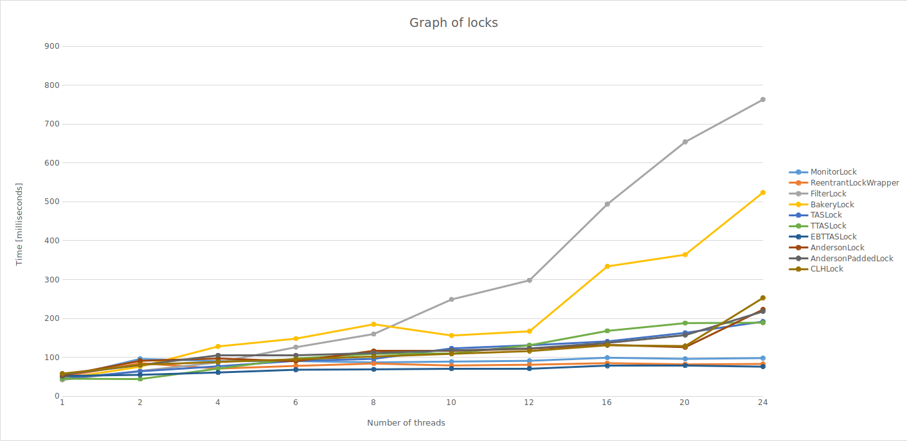
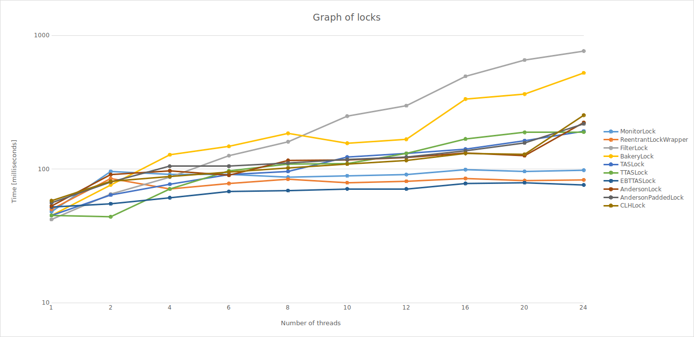

##### ClassicalLocks

- [ ] Write a test case using this lock, where two threads of identifiers 0 and 1, try to acquire the lock multiple (e.g. 10,000) times. Use the oracle to test for safety violations.
    
    [The code is here.](./src/2-threads/Worker.java)

- [ ] Fix the algorithm and explain the modification. *(link to your code and explanation)*

    [The code is here.](./src/2-threads/SafePetersonLock.java)  
    I made the array of `flag` into `AtomicBoolean​`. This way in every thread `flag` will be synchronized. Or we can use `volatile` for `victim`.

- [ ] Implement the Filter lock and test its correctness. *(link to your code)*

    [The code is here.](./src/n-threads/FilterLock.java)  
    Tested with this [Worker](./src/2-threads/Worker.java) and `SafetyOracle` shows no problem.

- [ ] Implement the Bakery lock and test its correctness. *(link to your code)*

    [The code is here.](./src/n-threads/BakeryLock.java)  
    Tested with this [Worker](./src/2-threads/Worker.java) and `SafetyOracle` shows no problem.

##### RMWLocks

- [ ] Implement in `TASLock.java` a lock based on the use of the *Test and Set* RMW operation for an arbitrary number of threads. Integrate this lock to the test case built in the previous section. *(link to your code)*

    [The code is here.](./src/n-threads/TASLock.java)
    
- [ ] Implement an evolution of the previous lock (keep both classes!) implementing the test-and-test-and-set strategy. *(link to your code)*
    
    [The code is here.](./src/n-threads/TTASLock.java)

- [ ] Implement an evolution of `TTASLock.java` (keep both classes!) implementing the exponential-backoff strategy. *(link to your code)*

    [The code is here.](./src/n-threads/EBTTASLock.java)

##### BetterLocks

- [ ] Implement the Anderson queue lock without padding. Integrate this lock to the test case built in the previous section. *(link to your code)*
    
    [The code is here.](./src/n-threads/AndersonLock.java)

- [ ] Implement the Anderson queue lock with padding (keep both versions). Integrate this lock to the test case built in the previous section. *(link to your code)*

    [The code is here.](./src/n-threads/AndersonPaddedLock.java)
    
- [ ] Implement the CLH lock. Integrate this lock to the test case built in the previous section. *(link to your code)*
    
    [The code is here.](./src/n-threads/CLHLock.java)

##### Evaluation

- [ ] Implement and run the benchmark on Burattini. Write a short (20-30 lines) report of your findings: Are the results and performance of the different locks as expected? Are there cases where the performance is not as good as you would expect? Provide a link to your final benchmark implementation. *(link to your code and explanation)*

    [Code of the worker.](./src/n-threads/Worker.java)  
    [Script of benchmark.](./src/n-threads/benchmark.sh)  
    I performed the test under the conditions described [here](./Evaluation.md) and run the benchmark 3-times to ensure I will avoid "JIT".
      
    Here you can see the graph of locks, 3rd-result from the test:
    
    
    Here is the same graph with logarithm scale of time to better see the difference:
    
    
    The result and performance for the most lock is as expected.  
    The EBTTASLock is surprise because in my test is the fastest one.  
    BakeryLock shows little deflection for 8 threads but it should be only momentarily bud luck because in data for 1st and 2nd results from test it is OK.  
    Next is TASLock which is faster for bigger number threads than TTASLock. 
    
    From this test I think it is needed to measure locks for little longer time to get better results. They need to do more "work" operations.
